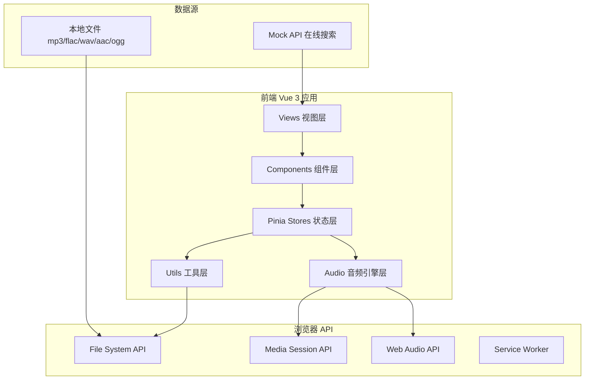
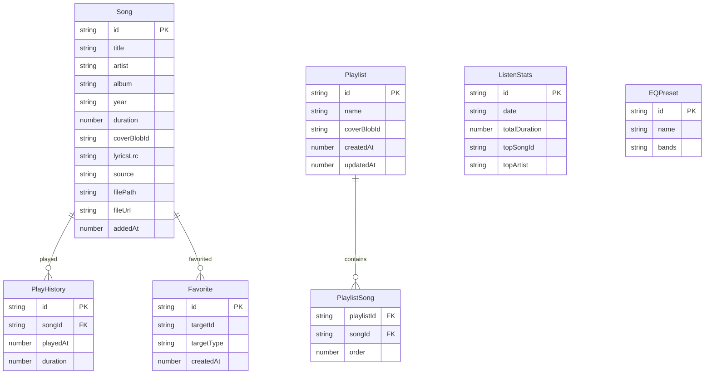

## 1. 架构设计



## 2. 技术说明

- **前端框架**：Vue 3 + TypeScript + Vite
- **初始化工具**：vite-init (vue-ts 模板)
- **状态管理**：Pinia（usePlayerStore、useMusicStore、usePlaylistStore）
- **路由**：Vue Router 4
- **样式**：Tailwind CSS 3 + CSS 变量动态主题
- **后端**：无（纯前端应用，Mock API）
- **数据库**：IndexedDB（Dexie.js 封装）存储音乐元数据和歌单
- **依赖清单**（≤8个）：
  - vue + vue-router + pinia（框架三件套）
  - music-metadata-browser（ID3 标签解析）
  - color-thief-browser（封面主色调提取）
  - dayjs（日期格式化）
  - dexie（IndexedDB 封装）
  - lucide-vue-next（图标库）

## 3. 路由定义

| 路由 | 用途 |
|------|------|
| / | 重定向到 /library |
| /library | 音乐库主页，本地音乐列表 + 在线搜索 |
| /playlist/:id? | 歌单详情，无 id 时显示歌单列表 |
| /search | 全文搜索页 |
| /settings | 设置页（均衡器、播放偏好、主题） |
| /stats | 收听统计页 |

## 4. API 定义

### 4.1 Mock 搜索 API

```typescript
interface SearchResult {
  id: string
  title: string
  artist: string
  album: string
  duration: number
  cover: string
  source: 'online'
  url: string
}

interface SearchResponse {
  results: SearchResult[]
  total: number
  query: string
}

// Mock 实现：前端内置假数据，延时 300ms 模拟网络
function mockSearch(keyword: string): Promise<SearchResponse>
```

### 4.2 Mock 翻译 API

```typescript
interface TranslateResponse {
  original: string
  translated: string
  lang: string
}

function mockTranslate(text: string, from: string, to: string): Promise<TranslateResponse>
```

## 5. 数据模型

### 5.1 数据模型定义



### 5.2 IndexedDB 存储定义

- **songs** 存储：id(主键), title, artist, album, year, duration, coverBlobId, lyricsLrc, source, filePath, fileUrl, addedAt + 索引 [artist, album, title]
- **playlists** 存储：id(主键), name, coverBlobId, createdAt, updatedAt
- **playlistSongs** 存储：[playlistId+order](复合主键), playlistId, songId, order + 索引 [playlistId, songId]
- **favorites** 存储：id(主键), targetId, targetType, createdAt + 索引 [targetId, targetType]
- **playHistory** 存储：id(主键), songId, playedAt, duration + 索引 [songId, playedAt]
- **eqPresets** 存储：id(主键), name, bands

## 6. 代码组织

```
src/
├── App.vue
├── main.ts
├── router/
│   └── index.ts
├── views/
│   ├── Library.vue
│   ├── Playlist.vue
│   ├── Search.vue
│   ├── Settings.vue
│   └── Stats.vue
├── components/
│   ├── player/
│   │   ├── PlayerBar.vue          # 底部播放器主组件
│   │   ├── PlayerFull.vue         # 全尺寸播放器
│   │   ├── PlayerMini.vue         # 迷你播放器
│   │   ├── ProgressBar.vue        # 进度条
│   │   ├── VolumeControl.vue      # 音量控制
│   │   ├── PlaybackControls.vue   # 播放控制按钮组
│   │   ├── SpeedControl.vue       # 倍速控制
│   │   └── CdCover.vue            # 3D 旋转 CD 封面
│   ├── lyrics/
│   │   ├── LyricsPanel.vue        # 歌词面板
│   │   ├── LyricsLine.vue         # 歌词行
│   │   └── DesktopLyrics.vue      # 桌面歌词窗口
│   ├── equalizer/
│   │   └── Equalizer.vue          # 均衡器
│   ├── visualizer/
│   │   └── Visualizer.vue         # 音频可视化
│   ├── playlist/
│   │   ├── PlaylistCard.vue       # 歌单卡片
│   │   └── PlaylistEditor.vue     # 歌单编辑器
│   ├── library/
│   │   ├── SongList.vue           # 歌曲列表
│   │   ├── SongItem.vue           # 歌曲行
│   │   └── ImportZone.vue         # 导入区域
│   ├── search/
│   │   └── SearchBar.vue          # 搜索框
│   └── common/
│       ├── Sidebar.vue            # 侧边栏导航
│       └── AccentColor.vue        # 动态强调色
├── stores/
│   ├── usePlayerStore.ts          # 播放器状态
│   ├── useMusicStore.ts           # 音乐库状态
│   └── usePlaylistStore.ts        # 歌单状态
├── composables/
│   ├── useAudioEngine.ts          # 音频引擎 composable
│   ├── useEqualizer.ts            # 均衡器 composable
│   ├── useMediaSession.ts         # Media Session composable
│   ├── useColorExtractor.ts       # 主色调提取 composable
│   └── useVisualizer.ts           # 可视化 composable
├── utils/
│   ├── id3-parser.ts              # ID3 解析封装
│   ├── lrc-parser.ts              # LRC 歌词解析
│   ├── filename-parser.ts         # 文件名智能解析
│   ├── visualizer-render.ts       # 可视化渲染算法
│   ├── db.ts                      # IndexedDB 封装
│   └── mock-api.ts                # Mock 搜索/翻译 API
├── audio/
│   ├── audio-context.ts           # AudioContext 单例
│   ├── eq.ts                      # 10 段均衡器
│   ├── crossfade.ts               # 淡入淡出
│   └── media-session.ts           # Media Session API
└── types/
    ├── song.ts                    # 歌曲类型
    ├── playlist.ts                # 歌单类型
    ├── player.ts                  # 播放器类型
    └── equalizer.ts               # 均衡器类型
```
